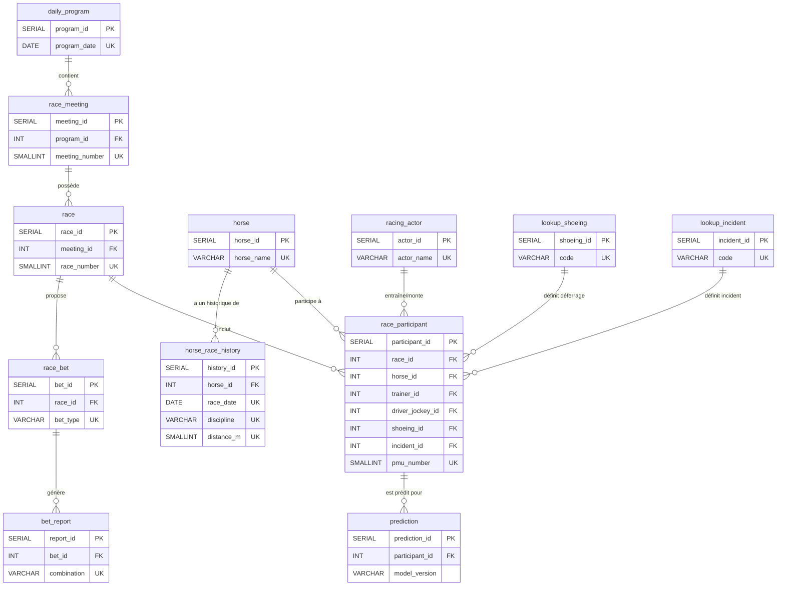

# Architecture et dictionnaire des données

## Introduction

Ce document décrit l'architecture de la base de données du projet, optimisée pour le stockage et la performance (version 4). Il détaille le schéma de chaque table, la description de chaque colonne et sa provenance depuis les sources de données JSON de l'API PMU.

### Sources de données (API PMU)

La base de données est peuplée à partir des quatre points d'accès JSON suivants :

1.  **Programme du jour (JSON 1)** : calendrier des réunions, courses et conditions.
2.  **Participants (JSON 2)** : liste des chevaux partants, caractéristiques et cotes.
3.  **Performances détaillées (JSON 3)** : historique de performance de chaque cheval.
4.  **Rapports définitifs (JSON 4)** : résultats des paris et dividendes.

## Vue d'ensemble des tables

La base de données est structurée autour des tables suivantes, normalisées pour réduire la redondance :

1.  **`daily_program`** : informations générales sur un programme de courses.
2.  **`race_meeting`** : détails d'une réunion de courses.
3.  **`race`** : informations sur une course individuelle (optimisée).
4.  **`horse`** : fiche d'identité des chevaux.
5.  **`racing_actor`** : référentiel unique des acteurs humains (entraîneurs, jockeys, drivers).
6.  **`lookup_shoeing`** : table de référence pour les états de déferrage.
7.  **`lookup_incident`** : table de référence pour les types d'incidents.
8.  **`race_participant`** : table centrale liant chevaux, acteurs et courses.
9.  **`horse_race_history`** : historique des performances passées.
10. **`race_bet`** : types de paris disponibles.
11. **`bet_report`** : rapports et dividendes.
12. **`prediction`** : stocke les prédictions des modèles ML.

## Schéma des relations

Le diagramme ci-dessous illustre les relations entre les tables, mettant en évidence la normalisation des acteurs et des statuts.

---

## Dictionnaire des données détaillé

### 1. `daily_program`
*   **Description** : contient les informations générales sur un programme de courses.
*   **Clé primaire** : `program_id`.
*   **Contrainte Unique** : `program_date`.

| Colonne | Type | Source (JSON 1) | Description | Disponibilité |
| :--- | :--- | :--- | :--- | :--- |
| `program_id` | `SERIAL` | interne | PK auto-incrémentée. | N/A |
| `program_date` | `DATE` | `programme.date` | la date du programme. | toujours |

### 2. `race_meeting`
*   **Description** : détails d'une réunion (R1, R2...) au sein d'un programme.
*   **Clé primaire** : `meeting_id`.
*   **Contrainte Unique** : `(program_id, meeting_number)`.

| Colonne | Type | Source (JSON 1) | Description | Disponibilité |
| :--- | :--- | :--- | :--- | :--- |
| `meeting_id` | `SERIAL` | interne | PK auto-incrémentée. | N/A |
| `program_id` | `INT` | interne | FK vers `daily_program`. | N/A |
| `meeting_number` | `SMALLINT` | `reunions[].numOfficiel` | numéro officiel (ex: 1). | toujours |
| `meeting_type` | `VARCHAR(30)` | `reunions[].nature` | nature (DIURNE, NOCTURNE). | toujours |
| `racetrack_code` | `VARCHAR(10)` | `reunions[].hippodrome.code` | code hippodrome court. | toujours |
| `weather_temperature`| `REAL` | `reunions[].meteo.temperature`| température (°C). | toujours |
| `weather_wind` | `VARCHAR(30)` | `reunions[].meteo.directionVent`| direction du vent. | toujours |

### 3. `race`
*   **Description** : informations sur une course individuelle (C1, C2...). Les colonnes vides ou redondantes ont été supprimées.
*   **Clé primaire** : `race_id`.
*   **Contrainte Unique** : `(meeting_id, race_number)`.

| Colonne | Type | Source (JSON 1) | Description | Disponibilité |
| :--- | :--- | :--- | :--- | :--- |
| `race_id` | `SERIAL` | interne | PK auto-incrémentée. | N/A |
| `meeting_id` | `INT` | interne | FK vers `race_meeting`. | N/A |
| `race_number` | `SMALLINT` | `...courses[].numOrdre` | numéro de la course (ex: 1). | toujours |
| `discipline` | `VARCHAR(10)` | `...courses[].discipline` | code discipline. | toujours |
| `race_category` | `VARCHAR(50)` | `...courses[].categorieParticularite` | catégorie (ex: GROUPE_I). | toujours |
| `distance_m` | `SMALLINT` | `...courses[].distance` | distance en mètres. | toujours |
| `track_type` | `VARCHAR(5)` | `...courses[].typePiste` | type (G, P...). | souvent null |
| `terrain_label` | `VARCHAR(30)` | `...courses[].penetrometre.intitule` | état terrain (BON, SOUPLE). | conditionnel |
| `penetrometer` | `REAL` | `...courses[].penetrometre.valeurMesure` | valeur terrain (4 octets). | galop herbe |
| `declared_runners_count`| `SMALLINT` | `...courses[].nombreDeclaresPartants` | nombre de partants. | toujours |
| `conditions_text` | `TEXT` | `...courses[].conditions` | texte des conditions (critique). | toujours |
| `race_status` | `VARCHAR(10)` | `...courses[].statut` | statut court. | toujours |
| `race_duration_s` | `INT` | `...courses[].dureeCourse` | durée de la course (sec). | toujours |
| `race_status_category`| `VARCHAR(30)`| interne | catégorie de statut normalisée. | toujours |

### 4. `horse`
*   **Description** : référentiel unique des chevaux.
*   **Clé primaire** : `horse_id`.
*   **Contrainte Unique** : `horse_name`.

| Colonne | Type | Source (JSON 2) | Description | Disponibilité |
| :--- | :--- | :--- | :--- | :--- |
| `horse_id` | `SERIAL` | interne | PK auto-incrémentée. | N/A |
| `horse_name` | `VARCHAR(100)`| `participants[].nom` | nom du cheval normalisé. | toujours |
| `sex` | `VARCHAR(1)` | `participants[].sexe` | code sexe (H, F, M). | toujours |
| `birth_year` | `SMALLINT` | calculé via `age` | année de naissance. | toujours |

### 5. `racing_actor`
*   **Description** : table de normalisation regroupant entraîneurs et jockeys/drivers pour éviter la duplication de chaînes de caractères.
*   **Clé primaire** : `actor_id`.
*   **Contrainte Unique** : `actor_name`.

| Colonne | Type | Source (JSON 2) | Description | Disponibilité |
| :--- | :--- | :--- | :--- | :--- |
| `actor_id` | `SERIAL` | interne | PK auto-incrémentée. | N/A |
| `actor_name` | `VARCHAR(100)`| `entraineur` / `driver` | nom complet de l'acteur. | toujours |

### 6. `lookup_shoeing`
*   **Description** : référentiel des statuts de déferrage.
*   **Clé primaire** : `shoeing_id`.

| Colonne | Type | Source (JSON 2) | Description |
| :--- | :--- | :--- | :--- |
| `shoeing_id` | `SERIAL` | interne | PK auto-incrémentée. |
| `code` | `VARCHAR(10)` | `participants[].deferre` | code (ex: D4, DA). |

### 7. `lookup_incident`
*   **Description** : référentiel des types d'incidents de course.
*   **Clé primaire** : `incident_id`.

| Colonne | Type | Source (JSON 2) | Description |
| :--- | :--- | :--- | :--- |
| `incident_id` | `SERIAL` | interne | PK auto-incrémentée. |
| `code` | `VARCHAR(30)` | `participants[].incident` | code incident (ex: DAI). |

### 8. `race_participant`
*   **Description** : table centrale optimisée. Les noms sont remplacés par des clés étrangères et les types numériques sont réduits (`REAL`, `SMALLINT`).
*   **Clé primaire** : `participant_id`.
*   **Contrainte Unique** : `(race_id, pmu_number)`.

| Colonne | Type | Source (JSON 2) | Description | Disponibilité |
| :--- | :--- | :--- | :--- | :--- |
| `participant_id` | `SERIAL` | interne | PK auto-incrémentée. | N/A |
| `race_id` | `INT` | interne | FK vers `race`. | N/A |
| `horse_id` | `INT` | interne | FK vers `horse`. | N/A |
| `pmu_number` | `SMALLINT` | `participants[].numPmu` | numéro dossard. | toujours |
| `age` | `SMALLINT` | `participants[].age` | âge au moment de la course. | toujours |
| `sex` | `VARCHAR(1)` | `participants[].sexe` | sexe contextuel. | toujours |
| `trainer_id` | `INT` | interne | FK vers `racing_actor`. | toujours |
| `driver_jockey_id`| `INT` | interne | FK vers `racing_actor`. | toujours |
| `shoeing_id` | `INT` | interne | FK vers `lookup_shoeing`. | conditionnel |
| `incident_id` | `INT` | interne | FK vers `lookup_incident`. | conditionnel |
| `career_races_count`| `SMALLINT`| `participants[].nombreCourses` | nb courses carrière. | toujours |
| `career_winnings` | `REAL` | `...gainsCarriere` | gains totaux (4 octets). | toujours |
| `reference_odds` | `REAL` | `...dernierRapportReference` | cote référence. | toujours |
| `live_odds` | `REAL` | `...dernierRapportDirect` | cote finale. | toujours |
| `raw_performance_string`|`VARCHAR(255)`| `participants[].musique` | musique tronquée si >255. | toujours |
| `finish_rank` | `SMALLINT` | `participants[].ordreArrivee` | rang final. | null si non classé |
| `time_achieved_s` | `INT` | `participants[].tempsObtenu` | temps réalisé (s). | conditionnel |
| `reduction_km` | `REAL` | `...reductionKilometrique` | vitesse (Red. Km). | conditionnel |
| `trainer_advice` | `VARCHAR(30)`| `...avisEntraineur` | avis (ex: POSITIF). | toujours |

### 9. `horse_race_history`
*   **Description** : historique des performances passées, optimisé pour le volume.
*   **Clé primaire** : `history_id`.
*   **Contrainte Unique** : `(horse_id, race_date, discipline, distance_m)`.

| Colonne | Type | Source (JSON 3) | Description | Disponibilité |
| :--- | :--- | :--- | :--- | :--- |
| `history_id` | `SERIAL` | interne | PK auto-incrémentée. | N/A |
| `horse_id` | `INT` | interne | FK vers `horse`. | N/A |
| `race_date` | `DATE` | `...coursesCourues[].date` | date de la performance. | toujours |
| `discipline` | `VARCHAR(20)`| `...coursesCourues[].discipline`| discipline. | toujours |
| `prize_money` | `REAL` | `...coursesCourues[].allocation`| allocation. | toujours |
| `distance_m` | `SMALLINT` | `...coursesCourues[].distance` | distance. | toujours |
| `first_place_time_s`| `INT` | `...tempsDuPremier` | temps du vainqueur. | conditionnel |
| `finish_place` | `SMALLINT` | `...participants[].place` | place obtenue. | null si non classé |
| `finish_status` | `VARCHAR(20)`| `...statusArrivee` | statut arrivée. | toujours |
| `jockey_weight` | `REAL` | `...poidsJockey` | poids porté. | galop |
| `draw_number` | `SMALLINT` | `...corde` | corde / stalle. | plat/obstacle |
| `reduction_km` | `REAL` | `...reductionKilometrique` | vitesse. | trot |
| `distance_traveled_m`|`SMALLINT`| `...distanceParcourue` | distance réelle. | toujours |

### 10. `race_bet`
*   **Description** : types de paris ouverts.
*   **Clé primaire** : `bet_id`.
*   **Contrainte Unique** : `(race_id, bet_type)`.

| Colonne | Type | Source (JSON 4) | Description | Disponibilité |
| :--- | :--- | :--- | :--- | :--- |
| `bet_id` | `SERIAL` | interne | PK auto-incrémentée. | N/A |
| `race_id` | `INT` | interne | FK vers `race`. | N/A |
| `bet_type` | `VARCHAR(10)`| `[].typePari` | code type. | toujours |
| `bet_family` | `VARCHAR(20)`| `[].famillePari` | famille. | toujours |
| `base_stake` | `REAL` | `[].miseBase` | mise de base (€). | toujours |
| `is_refunded` | `BOOLEAN` | `[].rembourse` | pari annulé ? | toujours |

### 11. `bet_report`
*   **Description** : rapports et gains.
*   **Clé primaire** : `report_id`.
*   **Contrainte Unique** : `(bet_id, combination)`.

| Colonne | Type | Source (JSON 4) | Description | Disponibilité |
| :--- | :--- | :--- | :--- | :--- |
| `report_id` | `SERIAL` | interne | PK auto-incrémentée. | N/A |
| `bet_id` | `INT` | interne | FK vers `race_bet`. | N/A |
| `combination` | `VARCHAR(50)`| `[].rapports[].combinaison` | combinaison gagnante. | toujours |
| `dividend` | `REAL` | `[].rapports[].dividende` | gain total. | toujours |
| `dividend_per_1e`| `REAL` | `[].rapports[].dividendePourUnEuro` | gain pour 1€. | toujours |
| `winners_count`| `REAL` | `[].rapports[].nombreGagnants` | nombre de mises gagnantes. | toujours |

### 12. `prediction`
*   **Description** : stocke les prédictions générées par les modèles de machine learning.
*   **Clé primaire** : `prediction_id`.
*   **Contraintes** : `participant_id` est une clé étrangère vers `race_participant`.

| Nom de la colonne | Type | Source (JSON) | Description | Disponibilité |
| :--- | :--- | :--- | :--- | :--- |
| `prediction_id` | `SERIAL` | interne | clé primaire auto-incrémentée. | N/A |
| `participant_id`| `INT` | interne | clé étrangère vers `race_participant`. | N/A |
| `model_version` | `VARCHAR(20)`| interne | version du modèle. | N/A |
| `proba_winner` | `REAL` | interne | probabilité de victoire. | N/A |
| `proba_top3_place`| `REAL` | interne | probabilité top 3. | N/A |
| `created_at` | `TIMESTAMP` | interne | horodatage de la prédiction. | N/A |