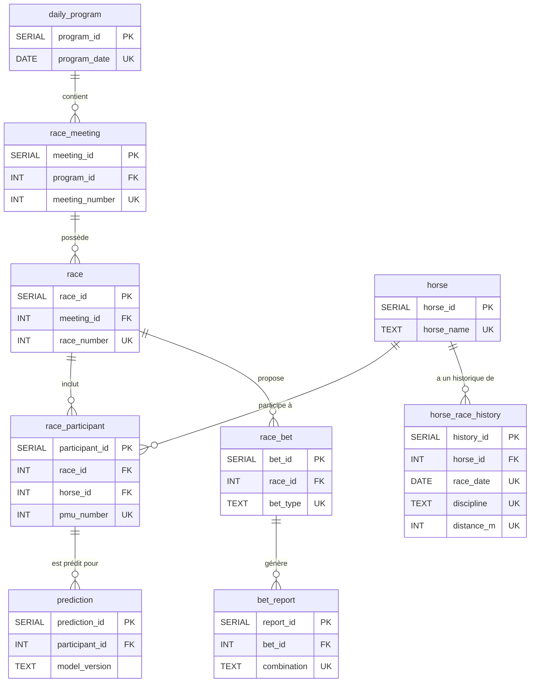

# Architecture et dictionnaire des données

## Introduction

Ce document décrit l'architecture de la base de données du projet. Il détaille le schéma de chaque table, la description de chaque colonne, et sa provenance exacte depuis les différentes sources de données JSON de l'API PMU.

### Sources de données (API PMU)

La base de données est peuplée à partir des quatre points d'accès JSON suivants. Les exemples de liens ci-dessous utilisent une date (05/11/2025), une réunion (R1) et une course (C1) séléctionnées arbitrairement.

1.  **Programme du jour (JSON 1)**: fournit le calendrier des réunions et des courses, ainsi que les conditions de course.
    *   `https://online.turfinfo.api.pmu.fr/rest/client/1/programme/05112025`
2.  **Participants (JSON 2)**: liste les chevaux partants pour une course donnée, avec leurs caractéristiques et les cotes.
    *   `https://online.turfinfo.api.pmu.fr/rest/client/61/programme/05112025/R1/C1/participants`
3.  **Performances détaillées (JSON 3)**: détaille l'historique de performance de chaque cheval participant à une course.
    *   `https://online.turfinfo.api.pmu.fr/rest/client/61/programme/05112025/R1/C1/performances-detaillees/pretty`
4.  **Rapports définitifs (JSON 4)**: donne les résultats des paris (combinaisons gagnantes et dividendes) après la fin d'une course.
    *   `https://online.turfinfo.api.pmu.fr/rest/client/1/programme/05112025/R1/C1/rapports-definitifs`

## Vue d'ensemble des tables

La base de données est structurée autour des tables suivantes :

1.  **`daily_program`** : informations générales sur un programme de courses d'une journée.
2.  **`race_meeting`** : détails d'une réunion de courses spécifique au sein d'un programme.
3.  **`race`** : informations sur une course individuelle au sein d'une réunion.
4.  **`horse`** : fiche d'identité des chevaux.
5.  **`race_participant`** : table centrale liant chevaux et courses, avec des informations spécifiques à leur participation.
6.  **`horse_race_history`** : historique des performances passées d'un cheval.
7.  **`race_bet`** : détails sur les types de paris disponibles pour une course.
8.  **`bet_report`** : rapports et dividendes associés à un pari.
9.  **`prediction`** : stocke les prédictions générées par les modèles ML.
10. **`raw_data_*`** : Tables pour le stockage des JSON bruts des données sources.

## Schéma des relations

Le diagramme ci-dessous illustre les relations entre les principales tables de la base de données.

---

## Dictionnaire des données détaillé

### 1. `daily_program`
*   **Description**: Contient les informations générales sur un programme de courses.
*   **Clé primaire**: `program_id`.
*   **Contrainte Unique**: `program_date` (Assure qu'on ne crée pas deux fois la même journée).

| Colonne | Type | Source (JSON 1) | Description | Disponibilité |
| :--- | :--- | :--- | :--- | :--- |
| `program_id` | `SERIAL` | Interne | PK auto-incrémentée. | N/A |
| `program_date` | `DATE` | `programme.date` | La date du programme. | Toujours |

### 2. `race_meeting`
*   **Description**: Détails d'une réunion (R1, R2...) au sein d'un programme.
*   **Clé primaire**: `meeting_id`.
*   **Contrainte Unique**: `(program_id, meeting_number)`.

| Colonne | Type | Source (JSON 1) | Description | Disponibilité |
| :--- | :--- | :--- | :--- | :--- |
| `meeting_id` | `SERIAL` | Interne | PK auto-incrémentée. | N/A |
| `program_id` | `INT` | Interne | FK vers `daily_program`. | N/A |
| `meeting_number` | `INT` | `reunions[].numOfficiel` | Numéro officiel (ex: 1 pour R1). | Toujours |
| `meeting_type` | `TEXT` | `reunions[].nature` | Nature (DIURNE, NOCTURNE). | Toujours |
| `racetrack_code` | `TEXT` | `reunions[].hippodrome.code` | Code hippodrome (ex: "VINC"). | Toujours |
| `weather_temperature`| `NUMERIC`| `reunions[].meteo.temperature`| Température (°C). | Toujours |
| `weather_wind` | `TEXT` | `reunions[].meteo.directionVent`| Direction du vent. | Toujours |

### 3. `race`
*   **Description**: Informations sur une course individuelle (C1, C2...).
*   **Clé primaire**: `race_id`.
*   **Contrainte Unique**: `(meeting_id, race_number)`.

| Colonne | Type | Source (JSON 1) | Description | Disponibilité |
| :--- | :--- | :--- | :--- | :--- |
| `race_id` | `SERIAL` | Interne | PK auto-incrémentée. | N/A |
| `meeting_id` | `INT` | Interne | FK vers `race_meeting`. | N/A |
| `race_number` | `INT` | `...courses[].numOrdre` | Numéro de la course (ex: 1 pour C1). | Toujours |
| `discipline` | `TEXT` | `...courses[].discipline` | ATTELE, MONTE, PLAT, etc. | Toujours |
| `race_category` | `TEXT` | `...courses[].categorieParticularite` | Catégorie (ex: GROUPE_I). | Toujours |
| `age_condition` | `TEXT` | `...courses[].conditionAge` | Conditions d'âge. | Parfois null |
| `distance_m` | `INT` | `...courses[].distance` | Distance en mètres. | Toujours |
| `track_type` | `TEXT` | `...courses[].typePiste` | Type (GAZON, PSF...). | Souvent null (Trot) |
| `terrain_label` | `TEXT` | `...courses[].penetrometre.intitule` | État terrain (BON, SOUPLE). | Conditionnel |
| `penetrometer` | `NUMERIC` | `...courses[].penetrometre.valeurMesure` | Valeur numérique du terrain. | Galop herbe |
| `declared_runners_count`| `INT` | `...courses[].nombreDeclaresPartants` | Nombre de partants. | Toujours |
| `conditions_text` | `TEXT` | `...courses[].conditions` | Texte complet des conditions. | Toujours |
| `race_status` | `TEXT` | `...courses[].statut` | Statut (ex: FIN_COURSE). | Toujours |
| `finish_order_raw` | `JSONB` | `...courses[].ordreArrivee` | Ordre d'arrivée brut (JSON). | Toujours |
| `race_duration_s` | `INT` | `...courses[].dureeCourse` | Durée de la course (sec). | Toujours |

### 4. `horse`
*   **Description**: Référentiel unique des chevaux.
*   **Clé primaire**: `horse_id`.
*   **Contrainte Unique**: **`horse_name`**.
    *   *Note Technique* : Cette contrainte est critique. Elle permet au script `ingest_participants` et `ingest_performances` de faire un `INSERT ... ON CONFLICT DO NOTHING` ou de récupérer l'ID via un cache thread-safe sans créer de doublons.

| Colonne | Type | Source (JSON 2) | Description | Disponibilité |
| :--- | :--- | :--- | :--- | :--- |
| `horse_id` | `SERIAL` | Interne | PK auto-incrémentée. | N/A |
| `horse_name` | `TEXT` | `participants[].nom` | Nom du cheval normalisé. | Toujours |
| `sex` | `TEXT` | `participants[].sexe` | Sexe (HONGRES, FEMELLES...). | Toujours |
| `birth_year` | `INT` | Calculé via `age` | Année de naissance. | Toujours |

### 5. `race_participant`
*   **Description**: Table de liaison "Course <-> Cheval" avec les données du jour J.
*   **Clé primaire**: `participant_id`.
*   **Contrainte Unique**: `(race_id, pmu_number)`. Un cheval a un dossard unique par course.

| Colonne | Type | Source (JSON 2) | Description | Disponibilité |
| :--- | :--- | :--- | :--- | :--- |
| `participant_id` | `SERIAL` | Interne | PK auto-incrémentée. | N/A |
| `race_id` | `INT` | Interne | FK vers `race`. | N/A |
| `horse_id` | `INT` | Interne | FK vers `horse`. | N/A |
| `pmu_number` | `INT` | `participants[].numPmu` | Numéro dossard. | Toujours |
| `age` | `INT` | `participants[].age` | Âge au moment de la course. | Toujours |
| `sex` | `TEXT` | `participants[].sexe` | Sexe contextuel. | Toujours |
| `trainer_name` | `TEXT` | `participants[].entraineur` | Entraîneur. | Toujours |
| `driver_jockey_name`| `TEXT` | `participants[].driver` | Driver / Jockey. | Toujours |
| `shoeing_status` | `TEXT` | `participants[].deferre` | Déferrage (D4, DA...). | Null si chaussé |
| `career_races_count`| `INT` | `participants[].nombreCourses` | Nb courses carrière. | Toujours |
| `career_winnings` | `NUMERIC` | `...gainsCarriere` | Gains totaux. | Toujours |
| `reference_odds` | `NUMERIC` | `...dernierRapportReference` | Cote référence (matin). | Toujours |
| `live_odds` | `NUMERIC` | `...dernierRapportDirect` | Cote finale. | Toujours |
| `raw_performance_string`|`TEXT`| `participants[].musique` | Musique (ex: 1a2aDa). | Toujours |
| `finish_rank` | `INT` | `participants[].ordreArrivee` | **Cible**: Rang final. | Null si non classé |
| `incident` | `TEXT` | `participants[].incident` | **Cible**: Incident (DAI...). | Conditionnel |
| `time_achieved_s` | `INT` | `participants[].tempsObtenu` | Temps réalisé (s). | Conditionnel |
| `reduction_km` | `NUMERIC` | `...reductionKilometrique` | Vitesse (Red. Km). | Conditionnel |
| `post_race_comment`| `TEXT` | `...commentaireApresCourse` | Commentaire texte. | Toujours |

### 6. `horse_race_history`
*   **Description**: Historique des performances passées (la "Musique" détaillée).
*   **Clé primaire**: `history_id`.
*   **Contrainte Unique**: **`(horse_id, race_date, discipline, distance_m)`**.
    *   *Justification Technique* : Cette table contient des millions de lignes. Pour l'ingestion, nous groupons les historiques par lots (Batch Processing). Cette contrainte composite permet d'insérer 500+ lignes d'un coup avec `ON CONFLICT DO NOTHING`, évitant de vérifier l'existence ligne par ligne (trop lent sur une BDD distante).

| Colonne | Type | Source (JSON 3) | Description | Disponibilité |
| :--- | :--- | :--- | :--- | :--- |
| `history_id` | `SERIAL` | Interne | PK auto-incrémentée. | N/A |
| `horse_id` | `INT` | Interne | FK vers `horse`. | N/A |
| `race_date` | `DATE` | `...coursesCourues[].date` | Date de la performance. | Toujours |
| `discipline` | `TEXT` | `...coursesCourues[].discipline`| Discipline. | Toujours |
| `prize_money` | `NUMERIC` | `...coursesCourues[].allocation`| Allocation de la course. | Toujours |
| `distance_m` | `INT` | `...coursesCourues[].distance` | Distance. | Toujours |
| `first_place_time_s`| `INT` | `...tempsDuPremier` | Temps du vainqueur. | Conditionnel |
| `finish_place` | `INT` | `...participants[].place` | Place obtenue. | Null si non classé |
| `finish_status` | `TEXT` | `...statusArrivee` | Statut (ARRIVEE, DISQUALIFIE).| Toujours |
| `jockey_weight` | `NUMERIC` | `...poidsJockey` | Poids porté. | Galop |
| `draw_number` | `INT` | `...corde` | Corde / Stalle. | Plat/Obstacle |
| `reduction_km` | `NUMERIC` | `...reductionKilometrique` | Vitesse. | Trot |
| `distance_traveled_m`|`INT`| `...distanceParcourue` | Distance réelle. | Toujours |

### 7. `race_bet`
*   **Description**: Types de paris ouverts.
*   **Clé primaire**: `bet_id`.
*   **Contrainte Unique**: `(race_id, bet_type)`. Evite de dupliquer l'offre de paris pour une même course.

| Colonne | Type | Source (JSON 4) | Description | Disponibilité |
| :--- | :--- | :--- | :--- | :--- |
| `bet_id` | `SERIAL` | Interne | PK auto-incrémentée. | N/A |
| `race_id` | `INT` | Interne | FK vers `race`. | N/A |
| `bet_type` | `TEXT` | `[].typePari` | Code type (E_SIMPLE_GAGNANT). | Toujours |
| `bet_family` | `TEXT` | `[].famillePari` | Famille (SIMPLE, COUPLE). | Toujours |
| `base_stake` | `NUMERIC` | `[].miseBase` | Mise de base (€). | Toujours |
| `is_refunded` | `BOOLEAN` | `[].rembourse` | Pari annulé/remboursé ? | Toujours |

### 8. `bet_report`
*   **Description**: Rapports et gains.
*   **Clé primaire**: `report_id`.
*   **Contrainte Unique**: `(bet_id, combination)`. Une combinaison (ex: "3-5") n'a qu'un seul rapport par type de pari.

| Colonne | Type | Source (JSON 4) | Description | Disponibilité |
| :--- | :--- | :--- | :--- | :--- |
| `report_id` | `SERIAL` | Interne | PK auto-incrémentée. | N/A |
| `bet_id` | `INT` | Interne | FK vers `race_bet`. | N/A |
| `combination` | `TEXT` | `[].rapports[].combinaison` | La combinaison gagnante. | Toujours |
| `dividend` | `NUMERIC` | `[].rapports[].dividende` | Gain total. | Toujours |
| `dividend_per_1e`| `NUMERIC` | `[].rapports[].dividendePourUnEuro` | Gain pour 1€. | Toujours |
| `winners_count`| `NUMERIC` | `[].rapports[].nombreGagnants` | Nombre de mises gagnantes. | Toujours |

---

### 9. `prediction`

*   **Description**: stocke les prédictions générées par les modèles de machine learning.
*   **Clé primaire**: `prediction_id`.
*   **Contraintes**: `participant_id` est une clé étrangère vers `race_participant`.

| Nom de la colonne | Type de données | Source (JSON: chemin) | Description | Utilisation | Disponibilité |
| :--- | :--- | :--- | :--- | :--- | :--- |
| `prediction_id` | `SERIAL` | Interne | Clé primaire auto-incrémentée. | Clé | N/A |
| `participant_id`| `INT` | Interne | Clé étrangère vers `race_participant`. | Clé | N/A |
| `model_version` | `TEXT` | Interne | Version du modèle ayant généré la prédiction. | Métadonnée | N/A |
| `proba_winner` | `NUMERIC` | Interne (sortie de modèle) | Probabilité que le cheval gagne la course. | Prédiction | N/A |
| `proba_top3_place`| `NUMERIC` | Interne (sortie de modèle) | Probabilité que le cheval termine dans le top 3. | Prédiction | N/A |
| `created_at` | `TIMESTAMP WITH TIME ZONE` | Interne | Horodatage de la création de la prédiction. | Métadonnée | N/A |

---

### 10. `raw_data_*`

*   **Description**: ces tables archivent les documents JSON bruts pour garantir la traçabilité et permettre de rejouer l'ingestion si nécessaire.
*   **Clé primaire**: `id`.

| Table | Colonne | Type de données | Description |
| :--- | :--- | :--- | :--- |
| `raw_program_data` | `id` | `SERIAL` | Clé primaire. |
| | `program_date` | `DATE` | Date du programme associée au JSON. |
| | `payload_json` | `JSONB` | Le document JSON brut du programme (JSON 1). |
| `raw_participants_data` | `id` | `SERIAL` | Clé primaire. |
| | `program_date` | `DATE` | Date du programme associée au JSON. |
| | `payload_json` | `JSONB` | Le document JSON brut des participants (JSON 2). |
| `raw_performances_data` | `id` | `SERIAL` | Clé primaire. |
| | `program_date` | `DATE` | Date du programme associée au JSON. |
| | `payload_json` | `JSONB` | Le document JSON brut des performances (JSON 3). |
| `raw_reports_data` | `id` | `SERIAL` | Clé primaire. |
| | `program_date` | `DATE` | Date du programme associée au JSON. |
| | `payload_json` | `JSONB` | Le document JSON brut des rapports (JSON 4). |