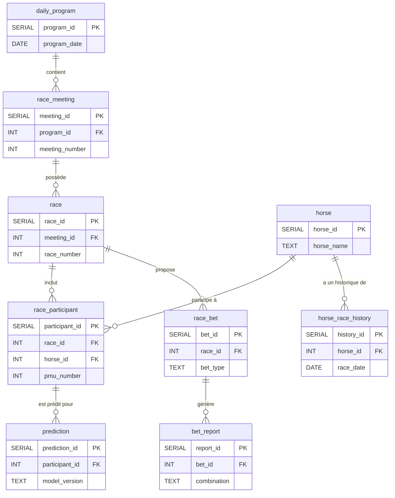

# Architecture et dictionnaire des données

## Introduction

Ce document décrit l'architecture de la base de données du projet. Il détaille le schéma de chaque table, la description de chaque colonne, et sa provenance exacte depuis les différentes sources de données JSON de l'API PMU.

### Sources de données (API PMU)

La base de données est peuplée à partir des quatre points d'accès JSON suivants. Les exemples de liens ci-dessous utilisent une date (05/11/2025), une réunion (R1) et une course (C1) séléctionnées arbitrairement.

1.  **Programme du jour (JSON 1)**: fournit le calendrier des réunions et des courses, ainsi que les conditions de course.
    *   `https://online.turfinfo.api.pmu.fr/rest/client/1/programme/05112025`
2.  **Participants (JSON 2)**: liste les chevaux partants pour une course donnée, avec leurs caractéristiques et les cotes.
    *   `https://online.turfinfo.api.pmu.fr/rest/client/61/programme/05112025/R1/C1/participants`
3.  **Performances détaillées (JSON 3)**: détaille l'historique de performance de chaque cheval participant à une course.
    *   `https://online.turfinfo.api.pmu.fr/rest/client/61/programme/05112025/R1/C1/performances-detaillees/pretty`
4.  **Rapports définitifs (JSON 4)**: donne les résultats des paris (combinaisons gagnantes et dividendes) après la fin d'une course.
    *   `https://online.turfinfo.api.pmu.fr/rest/client/1/programme/05112025/R1/C1/rapports-definitifs`

## Vue d'ensemble des tables

La base de données est structurée autour des tables suivantes :

1.  **`daily_program`** : informations générales sur un programme de courses d'une journée.
2.  **`race_meeting`** : détails d'une réunion de courses spécifique au sein d'un programme.
3.  **`race`** : informations sur une course individuelle au sein d'une réunion.
4.  **`horse`** : fiche d'identité des chevaux.
5.  **`race_participant`** : table centrale liant chevaux et courses, avec des informations spécifiques à leur participation.
6.  **`horse_race_history`** : historique des performances passées d'un cheval.
7.  **`race_bet`** : détails sur les types de paris disponibles pour une course.
8.  **`bet_report`** : rapports et dividendes associés à un pari.
9.  **`prediction`** : stocke les prédictions générées par les modèles ML.
10. **`raw_data_*`** : Tables pour le stockage des JSON bruts des données sources.

## Schéma des relations

Le diagramme ci-dessous illustre les relations entre les principales tables de la base de données.

## Dictionnaire des données par table

### 1. `daily_program`

*   **Description**: contient les informations générales sur un programme de courses pour une journée donnée.
*   **Clé primaire**: `program_id`.
*   **Contraintes**: la colonne `program_date` doit être unique.

| Nom de la colonne | Type de données | Source (JSON: chemin) | Description | Utilisation | Disponibilité |
| :--- | :--- | :--- | :--- | :--- | :--- |
| `program_id` | `SERIAL` | Interne | Clé primaire auto-incrémentée. | Clé | N/A |
| `program_date` | `DATE` | JSON 1: `programme.date` | La date du programme de courses. | Feature | Toujours |

---

### 2. `race_meeting`

*   **Description**: contient les détails d'une réunion de courses spécifique, rattachée à un `daily_program`.
*   **Clé primaire**: `meeting_id`.
*   **Contraintes**: la combinaison (`program_id`, `meeting_number`) est unique.

| Nom de la colonne | Type de données | Source (JSON: chemin) | Description | Utilisation | Disponibilité |
| :--- | :--- | :--- | :--- | :--- | :--- |
| `meeting_id` | `SERIAL` | Interne | Clé primaire auto-incrémentée. | Clé | N/A |
| `program_id` | `INT` | Interne | Clé étrangère vers `daily_program`. | Clé | N/A |
| `meeting_number` | `INT` | JSON 1: `reunions[].numOfficiel` | Numéro officiel de la réunion (ex: 1 pour R1). | Feature | Toujours |
| `meeting_type` | `TEXT` | JSON 1: `reunions[].nature` | Nature de la réunion (ex: "DIURNE", "NOCTURNE"). | Feature | Toujours |
| `racetrack_code` | `TEXT` | JSON 1: `reunions[].hippodrome.code` | Code de l'hippodrome (ex: "PET" pour Nantes). | Feature | Toujours |
| `weather_temperature` | `NUMERIC` | JSON 1: `reunions[].meteo.temperature` | Température mesurée ou prévue en degrés Celsius. | Feature | Toujours |
| `weather_wind` | `TEXT` | JSON 1: `reunions[].meteo.directionVent` | Direction ou description du vent. | Feature | Toujours |

---

### 3. `race`

*   **Description**: contient les informations détaillées sur une course individuelle au sein d'une réunion.
*   **Clé primaire**: `race_id`.
*   **Contraintes**: la combinaison (`meeting_id`, `race_number`) est unique.

| Nom de la colonne | Type de données | Source (JSON: chemin) | Description | Utilisation | Disponibilité |
| :--- | :--- | :--- | :--- | :--- | :--- |
| `race_id` | `SERIAL` | Interne | Clé primaire auto-incrémentée. | Clé | N/A |
| `meeting_id` | `INT` | Interne | Clé étrangère vers `race_meeting`. | Clé | N/A |
| `race_number` | `INT` | JSON 1: `reunions[].courses[].numOrdre` | Numéro de la course dans la réunion (ex: 1 pour C1). | Feature | Toujours |
| `discipline` | `TEXT` | JSON 1: `reunions[].courses[].discipline` | Discipline de la course (ex: "MONTE", "ATTELE", "PLAT"). | Feature | Toujours |
| `race_category` | `TEXT` | JSON 1: `reunions[].courses[].categorieParticularite` | Catégorie de la course (ex: "APPRENTIS_LADS_JOCKEYS"). | Feature | Toujours |
| `age_condition` | `TEXT` | JSON 1: `reunions[].courses[].conditionAge` | Conditions textuelles liées à l'âge des participants. | Feature | Conditionnel: parfois absente. |
| `distance_m` | `INT` | JSON 1: `reunions[].courses[].distance` | Distance de la course en mètres. | Feature | Toujours |
| `track_type` | `TEXT` | JSON 1: `reunions[].courses[].typePiste` | Type de piste (ex: "GAZON", "SABLE", "PSF"). | Feature | Conditionnel: souvent absent pour le trot. |
| `terrain_label` | `TEXT` | JSON 1: `reunions[].courses[].penetrometre.intitule` | État du terrain (ex: "SOUPLE", "BON"). | Feature | Conditionnel: dépend de la surface et de la discipline. |
| `penetrometer` | `NUMERIC` | JSON 1: `reunions[].courses[].penetrometre.valeurMesure` | Mesure de la souplesse du terrain (pénétromètre). | Feature | Conditionnel: souvent présent uniquement pour le galop sur herbe. |
| `declared_runners_count` | `INT` | JSON 1: `reunions[].courses[].nombreDeclaresPartants` | Nombre de chevaux déclarés au départ. | Feature | Toujours |
| `conditions_text` | `TEXT` | JSON 1: `reunions[].courses[].conditions` | Texte complet des conditions de participation à la course. | Feature | Toujours |
| `race_status` | `TEXT` | JSON 1: `reunions[].courses[].statut` | Statut de la course (ex: "FIN_COURSE"). | Cible / Leakage | Toujours |
| `finish_order_raw` | `JSONB` | JSON 1: `reunions[].courses[].ordreArrivee` | Ordre d'arrivée brut sous format JSON. | Cible / Leakage | Toujours |
| `race_duration_s` | `INT` | JSON 1: `reunions[].courses[].dureeCourse` | Durée de la course en secondes. | Cible / Leakage | Toujours |
| `race_status_category` | `TEXT` | JSON 1: `reunions[].courses[].categorieStatut` | Catégorie du statut (ex: "ARRIVEE"). | Cible / Leakage | Toujours |

---

### 4. `horse`

*   **Description**: stocke les informations d'identification uniques pour chaque cheval.
*   **Clé primaire**: `horse_id`.
*   **Contraintes**: le nom du cheval (`horse_name`) devrait être unique.

| Nom de la colonne | Type de données | Source (JSON: chemin) | Description | Utilisation | Disponibilité |
| :--- | :--- | :--- | :--- | :--- | :--- |
| `horse_id` | `SERIAL` | Interne | Clé primaire auto-incrémentée. | Clé | N/A |
| `horse_name` | `TEXT` | JSON 2: `participants[].nom` | Nom du cheval. | Feature | Toujours |
| `sex` | `TEXT` | JSON 2: `participants[].sexe` | Sexe du cheval ("HONGRES", "FEMELLES", "MALES"). | Feature | Toujours |
| `birth_year` | `INT` | Dérivé de `JSON 2: participants[].age` | Année de naissance du cheval, calculée à partir de son âge. | Feature | Toujours |

---

### 5. `race_participant`

*   **Description**: table centrale détaillant la participation d'un cheval à une course, incluant des informations pré-course et les résultats post-course.
*   **Clé primaire**: `participant_id`.
*   **Contraintes**: la combinaison (`race_id`, `pmu_number`) est unique.

| Nom de la colonne | Type de données | Source (JSON: chemin) | Description | Utilisation | Disponibilité |
| :--- | :--- | :--- | :--- | :--- | :--- |
| `participant_id` | `SERIAL` | Interne | Clé primaire auto-incrémentée. | Clé | N/A |
| `race_id` | `INT` | Interne | Clé étrangère vers `race`. | Clé | N/A |
| `horse_id` | `INT` | Interne | Clé étrangère vers `horse`. | Clé | N/A |
| `pmu_number` | `INT` | JSON 2: `participants[].numPmu` | Numéro du cheval pour la course (dossard). | Feature | Toujours |
| `age` | `INT` | JSON 2: `participants[].age` | Âge du cheval au moment de la course. | Feature | Toujours |
| `sex` | `TEXT` | JSON 2: `participants[].sexe` | Sexe du cheval (redondant avec `horse` mais contextuel à la course). | Feature | Toujours |
| `trainer_name` | `TEXT` | JSON 2: `participants[].entraineur` | Nom de l'entraîneur. | Feature | Toujours |
| `driver_jockey_name`| `TEXT` | JSON 2: `participants[].driver` | Nom du driver ou du jockey. | Feature | Toujours |
| `shoeing_status` | `TEXT` | JSON 2: `participants[].deferre` | Statut de déferrage (ex: "DEFERRE_4_PIEDS"). | Feature | Conditionnel: `null` si non applicable ou non déferré. |
| `career_races_count`| `INT` | JSON 2: `participants[].nombreCourses` | Nombre de courses disputées en carrière. | Feature | Toujours |
| `career_winnings` | `NUMERIC` | JSON 2: `participants[].gainsParticipant.gainsCarriere` | Gains cumulés du cheval en carrière. | Feature | Toujours |
| `reference_odds` | `NUMERIC` | JSON 2: `participants[].dernierRapportReference.rapport` | Cote de référence (souvent matinale). | Feature | Toujours |
| `live_odds` | `NUMERIC` | JSON 2: `participants[].dernierRapportDirect.rapport` | Dernière cote disponible avant le départ. | Frontière | Toujours, mais à utiliser avec prudence (proximité du leakage). |
| `raw_performance_string`|`TEXT`| JSON 2: `participants[].musique` | Chaîne de caractères brute des performances passées ("musique"). | Feature | Toujours |
| `trainer_advice` | `TEXT` | JSON 2: `participants[].avisEntraineur` | Avis de l'entraîneur avant la course. | Feature | Toujours |
| `finish_rank` | `INT` | JSON 2: `participants[].ordreArrivee` | Rang final du cheval dans la course. | Cible / Leakage | Conditionnel: `null` si non classé (disqualifié, tombé, etc.). |
| `incident` | `TEXT` | JSON 2: `participants[].incident` | Description de l'incident en course (ex: "DISQUALIFIE..."). | Cible / Leakage | Conditionnel: présent uniquement en cas d'incident. |
| `time_achieved_s` | `INT` | JSON 2: `participants[].tempsObtenu` | Temps réalisé par le cheval en secondes. | Cible / Leakage | Conditionnel: `null` si non classé ou non chronométré. |
| `reduction_km` | `NUMERIC` | JSON 2: `participants[].reductionKilometrique` | Vitesse moyenne ramenée au kilomètre. | Cible / Leakage | Conditionnel: `null` si non classé ou non chronométré. |
| `post_race_comment`| `TEXT` | JSON 2: `participants[].commentaireApresCourse.texte` | Commentaire sur la performance après la course. | Cible / Leakage | Toujours |

---

### 6. `horse_race_history` 

*   **Description**: enregistre les performances passées d'un cheval, extraites de ses données détaillées.
*   **Clé primaire**: `history_id`.
*   **Contraintes**: aucune contrainte d'unicité spécifique, un cheval a plusieurs lignes d'historique.

| Nom de la colonne | Type de données | Source (JSON: chemin) | Description | Utilisation | Disponibilité |
| :--- | :--- | :--- | :--- | :--- | :--- |
| `history_id` | `SERIAL` | Interne | Clé primaire auto-incrémentée. | Clé | N/A |
| `horse_id` | `INT` | Interne | Clé étrangère vers `horse`. | Clé | N/A |
| `race_date` | `DATE` | JSON 3: `participants[].coursesCourues[].date` | Date de la course historique. | Feature | Toujours |
| `discipline` | `TEXT` | JSON 3: `participants[].coursesCourues[].discipline` | Discipline de la course historique. | Feature | Toujours |
| `prize_money` | `NUMERIC` | JSON 3: `participants[].coursesCourues[].allocation` | Allocation totale de la course historique. | Feature | Toujours |
| `distance_m` | `INT` | JSON 3: `participants[].coursesCourues[].distance` | Distance de la course historique en mètres. | Feature | Toujours |
| `first_place_time_s`| `INT` | JSON 3: `participants[].coursesCourues[].tempsDuPremier` | Temps du vainqueur de la course historique en secondes. | Feature | Conditionnel: absent si le temps n'est pas disponible. |
| `finish_place` | `INT` | JSON 3: `participants[].coursesCourues[].participants[].place.place` | Place obtenue par le cheval. | Feature | Conditionnel: `null` en cas de non-classement. |
| `finish_status` | `TEXT` | JSON 3: `participants[].coursesCourues[].participants[].place.statusArrivee` | Statut à l'arrivée (ex: "PLACE", "DISQUALIFIE"). | Feature | Toujours |
| `jockey_weight` | `NUMERIC` | JSON 3: `participants[].coursesCourues[].participants[].poidsJockey` | Poids porté par le jockey (galop/obstacle). | Feature | Conditionnel: `null` pour le trot. |
| `draw_number` | `INT` | JSON 3: `participants[].coursesCourues[].participants[].corde` | Numéro de corde ou de stalle de départ. | Feature | Conditionnel: `null` pour le trot. |
| `reduction_km` | `NUMERIC` | JSON 3: `participants[].coursesCourues[].participants[].reductionKilometrique` | Réduction kilométrique réalisée par le cheval. | Feature | Conditionnel: absent si le chrono n'a pas été mesuré. |
| `distance_traveled_m`|`INT`| JSON 3: `participants[].coursesCourues[].participants[].distanceParcourue` | Distance réellement parcourue par le cheval. | Feature | Toujours |

---

### 7. `race_bet`

*   **Description**: stocke les détails sur les types de paris disponibles pour une course.
*   **Clé primaire**: `bet_id`.
*   **Contraintes**: `race_id` est une clé étrangère vers `race`.

| Nom de la colonne | Type de données | Source (JSON: chemin) | Description | Utilisation | Disponibilité |
| :--- | :--- | :--- | :--- | :--- | :--- |
| `bet_id` | `SERIAL` | Interne | Clé primaire auto-incrémentée. | Clé | N/A |
| `race_id` | `INT` | Interne | Clé étrangère vers `race`. | Clé | N/A |
| `bet_type` | `TEXT` | JSON 4: `[].typePari` | Type de pari (ex: "SIMPLE_GAGNANT"). | Feature | Toujours |
| `bet_family` | `TEXT` | JSON 4: `[].famillePari` | Famille du pari (ex: "Simple", "Couple"). | Feature | Toujours |
| `base_stake` | `NUMERIC` | JSON 4: `[].miseBase` | Mise de base pour le pari concerné. | Feature | Toujours |
| `is_refunded` | `BOOLEAN` | JSON 4: `[].rembourse` | Indique si le pari a été remboursé (annulé). | Cible / Leakage | Toujours |

---

### 8. `bet_report`

*   **Description**: contient les rapports et dividendes définitifs pour chaque type de pari d'une course.
*   **Clé primaire**: `report_id`.
*   **Contraintes**: `bet_id` est une clé étrangère vers `race_bet`.

| Nom de la colonne | Type de données | Source (JSON: chemin) | Description | Utilisation | Disponibilité |
| :--- | :--- | :--- | :--- | :--- | :--- |
| `report_id` | `SERIAL` | Interne | Clé primaire auto-incrémentée. | Clé | N/A |
| `bet_id` | `INT` | Interne | Clé étrangère vers `race_bet`. | Clé | N/A |
| `combination` | `TEXT` | JSON 4: `[].rapports[].combinaison` | Combinaison gagnante (ex: "7", "7-3"). | Cible / Leakage | Toujours |
| `dividend` | `NUMERIC` | JSON 4: `[].rapports[].dividende` | Dividende total pour la mise de base. | Cible / Leakage | Toujours |
| `dividend_per_1e`| `NUMERIC` | JSON 4: `[].rapports[].dividendePourUnEuro` | Dividende ramené à une mise de 1 euro. | Cible / Leakage | Toujours |
| `winners_count`| `NUMERIC` | JSON 4: `[].rapports[].nombreGagnants` | Nombre de tickets ou mises gagnantes. | Cible / Leakage | Toujours |

---

### 9. `prediction`

*   **Description**: stocke les prédictions générées par les modèles de machine learning.
*   **Clé primaire**: `prediction_id`.
*   **Contraintes**: `participant_id` est une clé étrangère vers `race_participant`.

| Nom de la colonne | Type de données | Source (JSON: chemin) | Description | Utilisation | Disponibilité |
| :--- | :--- | :--- | :--- | :--- | :--- |
| `prediction_id` | `SERIAL` | Interne | Clé primaire auto-incrémentée. | Clé | N/A |
| `participant_id`| `INT` | Interne | Clé étrangère vers `race_participant`. | Clé | N/A |
| `model_version` | `TEXT` | Interne | Version du modèle ayant généré la prédiction. | Métadonnée | N/A |
| `proba_winner` | `NUMERIC` | Interne (sortie de modèle) | Probabilité que le cheval gagne la course. | Prédiction | N/A |
| `proba_top3_place`| `NUMERIC` | Interne (sortie de modèle) | Probabilité que le cheval termine dans le top 3. | Prédiction | N/A |
| `created_at` | `TIMESTAMP WITH TIME ZONE` | Interne | Horodatage de la création de la prédiction. | Métadonnée | N/A |

---

### 10. `raw_data_*`

*   **Description**: ces tables archivent les documents JSON bruts pour garantir la traçabilité et permettre de rejouer l'ingestion si nécessaire.
*   **Clé primaire**: `id`.

| Table | Colonne | Type de données | Description |
| :--- | :--- | :--- | :--- |
| `raw_program_data` | `id` | `SERIAL` | Clé primaire. |
| | `program_date` | `DATE` | Date du programme associée au JSON. |
| | `payload_json` | `JSONB` | Le document JSON brut du programme (JSON 1). |
| `raw_participants_data` | `id` | `SERIAL` | Clé primaire. |
| | `program_date` | `DATE` | Date du programme associée au JSON. |
| | `payload_json` | `JSONB` | Le document JSON brut des participants (JSON 2). |
| `raw_performances_data` | `id` | `SERIAL` | Clé primaire. |
| | `program_date` | `DATE` | Date du programme associée au JSON. |
| | `payload_json` | `JSONB` | Le document JSON brut des performances (JSON 3). |
| `raw_reports_data` | `id` | `SERIAL` | Clé primaire. |
| | `program_date` | `DATE` | Date du programme associée au JSON. |
| | `payload_json` | `JSONB` | Le document JSON brut des rapports (JSON 4). |