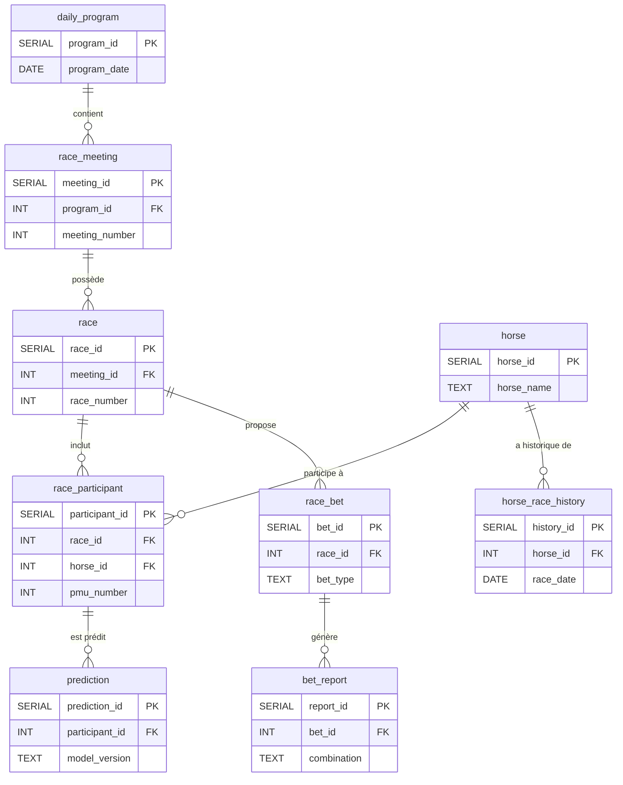

# Architecture de la base de données
---

## Vue d'ensemble des tables

La base de données est structurée autour des tables suivantes :

1.  **`daily_program`** : informations générales sur un programme de courses d'une journée.
2.  **`race_meeting`** : détails d'une réunion de courses spécifique au sein d'un programme.
3.  **`race`** : informations sur une course individuelle au sein d'une réunion.
4.  **`horse`** : fiche d'identité des chevaux.
5.  **`race_participant`** : table centrale liant chevaux et courses, avec des informations spécifiques à leur participation.
6.  **`horse_race_history`** : historique des performances passées d'un cheval.
7.  **`race_bet`** : détails sur les types de paris disponibles pour une course.
8.  **`bet_report`** : rapports et dividendes associés à un pari.
9.  **`prediction`** : stocke les prédictions générées par les modèles ML.
10. **`raw_data_*`** : Tables pour le stockage des JSON bruts des données sources.

---

## Schéma des tables et relations

### 1. `daily_program`

*   **Description** : contient les informations générales sur un programme de courses pour une journée donnée.
*   **Clé Primaire** : `program_id`
*   **Contraintes** : `program_date` doit être unique.

| Colonne        | Type de données | Contraintes / Commentaires           |
| :------------- | :-------------- | :----------------------------------- |
| `program_id`   | `SERIAL`        | Clé primaire, auto-incrémentée.      |
| `program_date` | `DATE`          | Date du programme (format YYYY-MM-DD). Doit être unique. |

### 2. `race_meeting`

*   **Description** : détails d'une réunion de courses spécifique, rattachée à un `daily_program`.
*   **Clé Primaire** : `meeting_id`
*   **Clé Étrangère** : `program_id` vers `daily_program`.
*   **Contraintes** : la combinaison (`program_id`, `meeting_number`) est unique.

| Colonne              | Type de données | Contraintes / Commentaires            |
| :------------------- | :-------------- | :------------------------------------ |
| `meeting_id`         | `SERIAL`        | Clé primaire, auto-incrémentée.       |
| `program_id`         | `INT`           | Clé étrangère vers `daily_program`.   |
| `meeting_number`     | `INT`           | Numéro de la réunion pour le programme. |
| `meeting_type`       | `TEXT`          | Nature de la réunion (ex: "PLAT", "TROT"). |
| `racetrack_code`     | `TEXT`          | Code ou nom de l'hippodrome.          |
| `weather_temperature`| `NUMERIC`       | Température en degrés Celsius.        |
| `weather_wind`       | `TEXT`          | Description du vent (ex: "faible", "fort"). |

### 3. `race`

*   **Description** : informations détaillées sur une course individuelle.
*   **Clé Primaire** : `race_id`
*   **Clé Étrangère** : `meeting_id` vers `race_meeting`.
*   **Contraintes** : la combinaison (`meeting_id`, `race_number`) est unique.

| Colonne                  | Type de données | Contraintes / Commentaires            |
| :----------------------- | :-------------- | :------------------------------------ |
| `race_id`                | `SERIAL`        | Clé primaire, auto-incrémentée.       |
| `meeting_id`             | `INT`           | Clé étrangère vers `race_meeting`.    |
| `race_number`            | `INT`           | Numéro de la course pour la réunion.  |
| `discipline`             | `TEXT`          | Discipline de la course (ex: "PLAT", "TROT"). |
| `race_category`          | `TEXT`          | Catégorie de la course (ex: "Handicap", "Listed"). |
| `age_condition`          | `TEXT`          | Conditions d'âge des participants.     |
| `distance_m`             | `INT`           | Distance de la course en mètres.      |
| `track_type`             | `TEXT`          | Type de piste (ex: "Herbe", "Sable"). |
| `terrain_label`          | `TEXT`          | État du terrain (ex: "Souple", "Lourd"). |
| `penetrometer`           | `NUMERIC`       | Valeur du pénétromètre (mesure de la souplesse du terrain). |
| `declared_runners_count` | `INT`           | Nombre de partants déclarés.          |
| `conditions_text`        | `TEXT`          | Texte complet des conditions de la course. |
| `race_status`            | `TEXT`          | Statut de la course (ex: "Arrivée définitive", "Non courue"). |
| `finish_order_raw`       | `JSONB`         | Ordre d'arrivée brut sous format JSON (permet une flexibilité). (**leakage**) |
| `race_duration_s`        | `INT`           | Durée totale de la course en secondes. (**leakage**) |

### 4. `horse`

*   **Description** : informations d'identification des chevaux.
*   **Clé Primaire** : `horse_id`

| Colonne          | Type de données | Contraintes / Commentaires           |
| :--------------- | :-------------- | :----------------------------------- |
| `horse_id`       | `SERIAL`        | Clé primaire, auto-incrémentée.      |
| `horse_name`     | `TEXT`          | Nom du cheval.                       |
| `sex`            | `TEXT`          | Sexe du cheval (ex: "M", "F", "H" pour hongre). |
| `birth_year`     | `INT`           | Année de naissance du cheval. Peut être NULL. |

### 5. `race_participant`

*   **Description** : table centrale détaillant la participation d'un cheval à une course spécifique, incluant des informations pré-course et post-course (cibles pour le ML).
*   **Clé Primaire** : `participant_id`
*   **Clés Étrangères** :
    *   `race_id` vers `race`.
    *   `horse_id` vers `horse`.
*   **Contraintes** : la combinaison (`race_id`, `pmu_number`) est unique.

| Colonne                  | Type de données | Contraintes / Commentaires           |
| :----------------------- | :-------------- | :----------------------------------- |
| `participant_id`         | `SERIAL`        | Clé primaire, auto-incrémentée.      |
| `race_id`                | `INT`           | Clé étrangère vers `race`.           |
| `horse_id`               | `INT`           | Clé étrangère vers `horse`.          |
| `pmu_number`             | `INT`           | Numéro PMU du cheval pour la course. |
| `age`                    | `INT`           | Âge du cheval lors de la course.     |
| `sex`                    | `TEXT`          | Sexe du cheval (peut être redondant avec `horse`, mais spécifique à la course). |
| `trainer_name`           | `TEXT`          | Nom de l'entraîneur.                 |
| `driver_jockey_name`     | `TEXT`          | Nom du driver ou jockey.             |
| `shoeing_status`         | `TEXT`          | Statut de déferrage (ex: "D4", "P2"). |
| `career_races_count`     | `INT`           | Nombre de courses courues en carrière. |
| `career_winnings`        | `NUMERIC`       | Gains cumulés en carrière.           |
| `reference_odds`         | `NUMERIC`       | Cote de référence avant la course.    |
| `live_odds`              | `NUMERIC`       | Cote en direct au départ de la course. (**leakage**) |
| `raw_performance_string` | `TEXT`          | Chaîne brute de la "musique" du cheval. |
| `trainer_advice`         | `TEXT`          | Avis de l'entraîneur *avant* la course.           |
| **Cibles (post-course)** |                 |                                      |
| `finish_rank`            | `INT`           | Rang d'arrivée final (NULL si non classé). (**leakage**) |
| `incident`               | `TEXT`          | Description d'un incident pendant la course (ex: "tombé", "distancé"). (**leakage**) |
| `time_achieved_s`        | `INT`           | Temps réalisé en secondes. (**leakage**)          |
| `reduction_km`           | `NUMERIC`       | Réduction kilométrique (vitesse moyenne). (**leakage**) |
| `post_race_comment`      | `TEXT`          | Commentaire après la course. (**leakage**)        |

### 6. `horse_race_history`

*   **Description** : enregistre les résultats passés des courses individuelles pour chaque cheval, utile pour l'historique et les caractéristiques ML.
*   **Clé Primaire** : `history_id`
*   **Clé Étrangère** : `horse_id` vers `horse`.

| Colonne                 | Type de données | Contraintes / Commentaires           |
| :---------------------- | :-------------- | :----------------------------------- |
| `history_id`            | `SERIAL`        | Clé primaire, auto-incrémentée.      |
| `horse_id`              | `INT`           | Clé étrangère vers `horse`.          |
| `race_date`             | `DATE`          | Date de la course historique.        |
| `discipline`            | `TEXT`          | Discipline de la course historique.  |
| `prize_money`           | `NUMERIC`       | Allocation de la course historique.  |
| `distance_m`            | `INT`           | Distance de la course historique en mètres. |
| `first_place_time_s`    | `INT`           | Temps du premier de la course historique en secondes. |
| `finish_place`          | `INT`           | Place obtenue par le cheval.         |
| `finish_status`         | `TEXT`          | Statut à l'arrivée (ex: "Arrivé", "Tombé"). |
| `jockey_weight`         | `NUMERIC`       | Poids porté par le jockey.           |
| `draw_number`           | `INT`           | Numéro de corde ou de stalle.       |
| `reduction_km`          | `NUMERIC`       | Réduction kilométrique.              |
| `distance_traveled_m`   | `INT`           | Distance parcourue par le cheval en mètres. |

### 7. `race_bet`

*   **Description** : détails des paris disponibles et leurs configurations pour une course.
*   **Clé Primaire** : `bet_id`
*   **Clé Étrangère** : `race_id` vers `race`.

| Colonne       | Type de données | Contraintes / Commentaires           |
| :------------ | :-------------- | :----------------------------------- |
| `bet_id`      | `SERIAL`        | Clé primaire, auto-incrémentée.      |
| `race_id`     | `INT`           | Clé étrangère vers `race`.           |
| `bet_type`    | `TEXT`          | Type de pari (ex: "Gagnant", "Placé"). |
| `bet_family`  | `TEXT`          | Famille de pari (ex: "Simple", "Couplé"). |
| `base_stake`  | `NUMERIC`       | Mise de base pour ce type de pari.   |
| `is_refunded` | `BOOLEAN`       | Indique si le pari a été remboursé.  |

### 8. `bet_report`

*   **Description** : rapports et dividendes associés aux paris d'une course.
*   **Clé Primaire** : `report_id`
*   **Clé Étrangère** : `bet_id` vers `race_bet`.

| Colonne             | Type de données | Contraintes / Commentaires           |
| :------------------ | :-------------- | :----------------------------------- |
| `report_id`         | `SERIAL`        | Clé primaire, auto-incrémentée.      |
| `bet_id`            | `INT`           | Clé étrangère vers `race_bet`.       |
| `combination`       | `TEXT`          | Combinaison gagnante du pari (ex: "1-2-3"). |
| `dividend`          | `NUMERIC`       | Dividende total pour la combinaison. |
| `dividend_per_1e`   | `NUMERIC`       | Dividende ramené à une mise de 1€.    |
| `winners_count`     | `NUMERIC`       | Nombre de gagnants pour cette combinaison. |

### 9. `prediction`

*   **Description** : stocke les prédictions générées par les modèles de Machine Learning pour chaque participant.
*   **Clé Primaire** : `prediction_id`
*   **Clé Étrangère** : `participant_id` vers `race_participant`.

| Colonne             | Type de données | Contraintes / Commentaires           |
| :------------------ | :-------------- | :----------------------------------- |
| `prediction_id`     | `SERIAL`        | Clé primaire, auto-incrémentée.      |
| `participant_id`    | `INT`           | Clé étrangère vers `race_participant`. |
| `model_version`     | `TEXT`          | Version du modèle ML ayant généré la prédiction. |
| `proba_winner`      | `NUMERIC`       | Probabilité que le cheval gagne la course. |
| `proba_top3_place`  | `NUMERIC`       | Probabilité que le cheval finisse dans le top 3. |
| `created_at`        | `TIMESTAMP WITH TIME ZONE` | Horodatage de la création de la prédiction. |

---

### 10. Tables `raw_data_*` 

*   **Description** : ces tables sont destinées à stocker les JSON bruts des données sources, avant toute transformation. Utile pour l'audit, le rejeu ou la réingénierie des features.
*   **Clé Primaire** : `id`

| Table                     | Colonne       | Type de données | Contraintes / Commentaires           |
| :------------------------ | :------------ | :-------------- | :----------------------------------- |
| `raw_program_data`        | `id`          | `SERIAL`        | Clé primaire.                        |
|                           | `program_date`| `DATE`          | Date du programme associée au JSON.  |
|                           | `payload_json`| `JSONB`         | Le document JSON brut du programme.  |
| `raw_participants_data`   | `id`          | `SERIAL`        | Clé primaire.                        |
|                           | `program_date`| `DATE`          | Date du programme associée au JSON.  |
|                           | `payload_json`| `JSONB`         | Le document JSON brut des participants. |
| `raw_performances_data`   | `id`          | `SERIAL`        | Clé primaire.                        |
|                           | `program_date`| `DATE`          | Date du programme associée au JSON.  |
|                           | `payload_json`| `JSONB`         | Le document JSON brut des performances. |
| `raw_reports_data`        | `id`          | `SERIAL`        | Clé primaire.                        |
|                           | `program_date`| `DATE`          | Date du programme associée au JSON.  |
|                           | `payload_json`| `JSONB`         | Le document JSON brut des rapports.  |

---

## Relations entre les tables 

